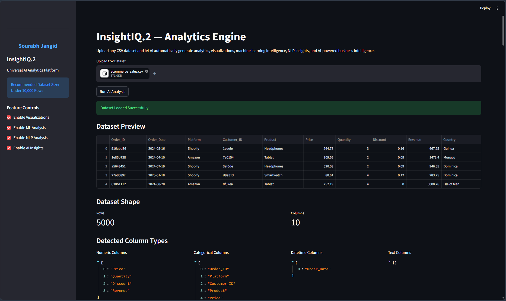
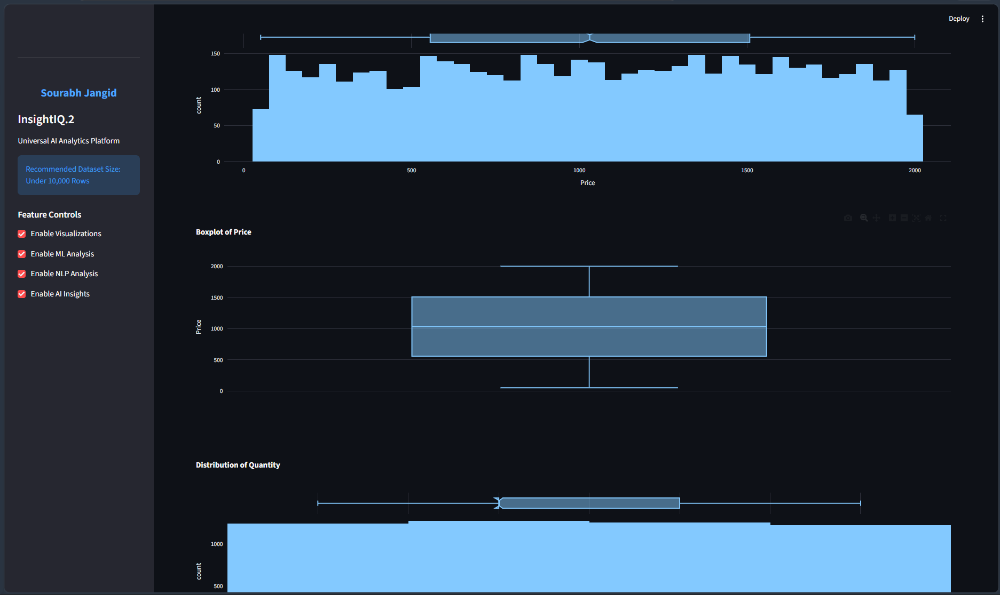

## phase -1 
WHAT WE WILL BUILD
Upload Dataset
      ↓
Schema Detection
      ↓
Column Classification
      ↓
Automatic Analytics
      ↓
Dynamic Visualizations
      ↓
AI Insights


## final phase 
Final system:

Upload Any CSV
       ↓
Schema Detection
       ↓
Automatic Analytics
       ↓
ML Intelligence
       ↓
NLP Detection
       ↓
AI Insights
       ↓
Anomaly Detection
       ↓
Forecasting
       ↓
Business Recommendations
       ↓
Deployment



# InsightIQ.2

InsightIQ.2 is a project I built to make data analysis more interactive, dynamic, and beginner-friendly.

While working on different datasets, I noticed that most dashboards are built for one specific dataset only. If the structure changes, the whole dashboard usually breaks or needs to be rebuilt manually. I wanted to solve that problem by creating a system that can automatically understand uploaded datasets and generate insights dynamically.

The idea behind this project was simple:

Upload a CSV file → let the system understand the data → generate analytics automatically.

Instead of hardcoding charts and analysis for one dataset, InsightIQ.2 tries to detect the structure of the uploaded dataset and perform intelligent analysis based on the detected columns.

---

# What This Project Can Do

### Dynamic Dataset Understanding

The system automatically detects:

* Numeric columns
* Categorical columns
* Datetime columns
* Text/review columns

This allows the platform to work with multiple dataset types instead of being limited to a single format.

---

# Automated Analytics

InsightIQ.2 can automatically generate:

* Statistical summaries
* Correlation analysis
* Distribution analysis
* Dynamic visualizations

without requiring manual dashboard setup.

---

# Machine Learning Features

The platform also includes:

* Dynamic clustering analysis
* Data segmentation
* Pattern analysis

using Scikit-learn.

---

# NLP Features

If the uploaded dataset contains reviews or text columns, the system can perform:

* Sentiment analysis
* Review classification
* Positive/Negative/Neutral detection

automatically.

---

# AI Insights Engine

The project also generates simple AI-powered insights such as:

* Missing value analysis
* Duplicate detection
* Variability analysis
* Dataset summaries

to help users quickly understand the uploaded data.

---

# Technologies Used

Frontend:

* Streamlit

Data Processing:

* Pandas
* NumPy

Visualization:

* Plotly
* Matplotlib

Machine Learning:

* Scikit-learn

NLP:

* TextBlob


---

# Project Structure

```bash
InsightIQ.2/
│
├── app/
│   ├── dashboard.py
│   ├── utils/
│   │   ├── loader.py
│   │   ├── cleaner.py
│   │   ├── detector.py
│   │   ├── visualizer.py
│   │   ├── analytics_engine.py
│   │   ├── ml_engine.py
│   │   ├── nlp_engine.py
│   │   ├── insights.py
│
├── data/
├── requirements.txt
├── README.md
```

---

# How To Run The Project

Clone the repository:

```bash
git clone https://github.com/sourabh253/InsightIQ.git
```

Move into the project folder:

```bash
cd InsightIQ
```

Create virtual environment:

```bash
python -m venv venv
```

Activate virtual environment:

### Windows

```bash
venv\Scripts\activate
```

Install required libraries:

```bash
pip install -r requirements.txt
```

Run the application:

```bash

streamlit run app/dashboard.py

---

# Supported Dataset

Currently supported:

* CSV files
* Datasets under 10,000 rows

Recommended dataset types:

* Ecommerce datasets
* Sales datasets
* Customer analytics datasets
* Review datasets
* Finance datasets

---

# Why I Built This

I built this project mainly to explore how AI and automation can improve traditional data analytics workflows.

Most beginner projects focus only on visualizations or one fixed dataset. I wanted to build something more flexible that can dynamically adapt to different uploaded datasets and still generate useful insights automatically.

This project also helped me improve:

* modular project architecture
* machine learning integration
* NLP pipelines
* scalable dashboard design
* performance optimization

---

# Future Improvements

Some features I plan to add in future:

* Forecasting engine
* AI chat with dataset
* PDF report generation
* Natural language querying
* AutoML integration
* Cloud deployment

---

# Developer

Engineered by Sourabh Jangid

LinkedIn:
[www.linkedin.com/in/sourabh-jangid-668745341](http://www.linkedin.com/in/sourabh-jangid-668745341)

GitHub:
https://github.com/sourabh253